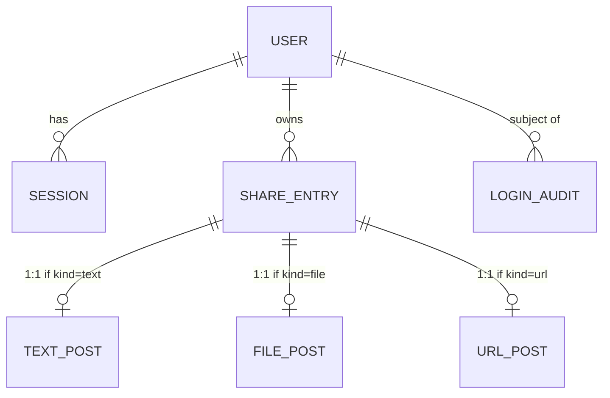

# Phase 1: Data Model — sharebox MVP

**Date**: 2026-04-12
**Branch**: `001-sharebox-mvp`
**Storage**: Cloudflare D1 (SQLite). ファイル実体は R2 を参照するためのキーのみ
D1 に保持する。

---

## エンティティ概要

| エンティティ     | 用途                           | 物理テーブル  |
| ---------------- | ------------------------------ | ------------- |
| User             | アプリ唯一の所有者             | `user`        |
| Session          | OAuth ログイン後のセッション   | `session`     |
| ShareEntry       | タイムラインの全エントリの基底 | `share_entry` |
| TextPost         | テキスト投稿の本文             | `text_post`   |
| FilePost         | ファイル投稿のメタデータ       | `file_post`   |
| UrlPost          | URL 投稿 + OGP メタデータ      | `url_post`    |
| LoginAuditRecord | ログイン試行の監査ログ         | `login_audit` |

ShareEntry をスーパータイプとして 3 つの種別テーブルが 1:1 で接続するクラス
継承パターン。`share_entry.kind` により読み出し時に正しいサブテーブルを join する。

---

## ER 図 (mermaid)



---

## テーブル詳細

### `user`

唯一の所有者。Google OAuth から取得した永続 ID で識別する。

| カラム         | 型        | 制約              | 説明                                |
| -------------- | --------- | ----------------- | ----------------------------------- |
| `id`           | `TEXT`    | `PRIMARY KEY`     | UUID v4 (アプリ内生成)              |
| `google_sub`   | `TEXT`    | `UNIQUE NOT NULL` | Google ID トークンの `sub` クレーム |
| `email`        | `TEXT`    | `NOT NULL`        | Google プロフィールメール           |
| `display_name` | `TEXT`    | NULL 可           | 表示名                              |
| `avatar_url`   | `TEXT`    | NULL 可           | プロフィール画像 URL (Google CDN)   |
| `created_at`   | `INTEGER` | `NOT NULL`        | UNIX epoch (ms)                     |
| `updated_at`   | `INTEGER` | `NOT NULL`        | UNIX epoch (ms)                     |

**インデックス**: `google_sub` に UNIQUE。

**バリデーション**:

- ホワイトリスト (環境変数 `OWNER_EMAIL`) と `email` が一致しない場合、レコード
  自体を作らずログイン拒否する (FR-002)。

---

### `session`

`@oslojs/crypto` で生成したセッショントークンの SHA-256 ハッシュを保持する。
トークン平文は HttpOnly Secure Cookie のみで保管する。

| カラム       | 型        | 制約                                             | 説明                             |
| ------------ | --------- | ------------------------------------------------ | -------------------------------- |
| `id`         | `TEXT`    | `PRIMARY KEY`                                    | セッショントークンの SHA-256 hex |
| `user_id`    | `TEXT`    | `NOT NULL REFERENCES user(id) ON DELETE CASCADE` | 所有者                           |
| `expires_at` | `INTEGER` | `NOT NULL`                                       | UNIX epoch (ms)。30 日後         |

**インデックス**: `user_id` に index。

**ライフサイクル**:

- 作成: ログイン成功時。トークン生成 → ハッシュ保存 → cookie に平文をセット
- 検証: リクエスト毎に cookie の値をハッシュ化して `id` で lookup
- 延長: アクセス時、残り有効期限が 15 日未満なら `expires_at` を 30 日後に更新
- 破棄: ログアウト時に DELETE。期限切れは遅延削除 (検証時に `expires_at <
now()` なら DELETE)

---

### `share_entry`

タイムラインに表示される全エントリの基底レコード。種別 `text` / `file` / `url`
ごとに対応するサブテーブルへ 1:1 で接続する。

| カラム       | 型        | 制約                                             | 説明            |
| ------------ | --------- | ------------------------------------------------ | --------------- |
| `id`         | `TEXT`    | `PRIMARY KEY`                                    | UUID v4         |
| `user_id`    | `TEXT`    | `NOT NULL REFERENCES user(id) ON DELETE CASCADE` | 所有者          |
| `kind`       | `TEXT`    | `NOT NULL CHECK (kind IN ('text','file','url'))` | 種別判別        |
| `created_at` | `INTEGER` | `NOT NULL`                                       | UNIX epoch (ms) |

**インデックス**:

- `(user_id, created_at DESC)` — タイムライン取得用の主要インデックス
- `(user_id, kind, created_at DESC)` — フィルタ表示用 (FR-008)

**削除**:

- 単一エントリ削除時、該当サブテーブルのレコードと、`file_post` の場合は
  R2 上のオブジェクトもトランザクション境界で削除する (R2 削除はアプリ層で
  best-effort、整合性は最終的整合)。

---

### `text_post`

| カラム        | 型        | 制約                                                       | 説明                        |
| ------------- | --------- | ---------------------------------------------------------- | --------------------------- |
| `entry_id`    | `TEXT`    | `PRIMARY KEY REFERENCES share_entry(id) ON DELETE CASCADE` | 親エントリ                  |
| `body`        | `TEXT`    | `NOT NULL`                                                 | 本文 (空白のみは禁止)       |
| `byte_length` | `INTEGER` | `NOT NULL`                                                 | UTF-8 バイト長 (容量集計用) |

**バリデーション**:

- 文字数上限 100,000 (FR-014)
- 空白のみは投稿前に reject (FR-013)
- 改行はそのまま保持

---

### `file_post`

| カラム          | 型        | 制約                                                       | 説明                                 |
| --------------- | --------- | ---------------------------------------------------------- | ------------------------------------ |
| `entry_id`      | `TEXT`    | `PRIMARY KEY REFERENCES share_entry(id) ON DELETE CASCADE` | 親エントリ                           |
| `r2_key`        | `TEXT`    | `UNIQUE NOT NULL`                                          | R2 オブジェクトキー (`files/<uuid>`) |
| `original_name` | `TEXT`    | `NOT NULL`                                                 | アップロード時のファイル名           |
| `mime_type`     | `TEXT`    | `NOT NULL`                                                 | MIME (例: `image/png`)               |
| `byte_size`     | `INTEGER` | `NOT NULL`                                                 | バイト数 (50MB 上限)                 |
| `category`      | `TEXT`    | `NOT NULL CHECK (category IN ('image','video','other'))`   | プレビュー判定用                     |

**バリデーション**:

- `byte_size` ≤ 50 × 1024 × 1024 (FR-017)
- `category` は `mime_type` の prefix (`image/*` / `video/*`) から導出
- `original_name` のサニタイズ: パス区切り `/` `\` を含む場合は basename のみ保持

**プレビュー判定**:

- `category = 'image'` → `` でインラインプレビュー
- `category = 'video'` → `<video preload="metadata">`
- `category = 'other'` → 拡張子別アイコン + 名前 + サイズ表示

---

### `url_post`

| カラム            | 型        | 制約                                                            | 説明                            |
| ----------------- | --------- | --------------------------------------------------------------- | ------------------------------- |
| `entry_id`        | `TEXT`    | `PRIMARY KEY REFERENCES share_entry(id) ON DELETE CASCADE`      | 親エントリ                      |
| `url`             | `TEXT`    | `NOT NULL`                                                      | 投稿された URL (正規化前の原文) |
| `domain`          | `TEXT`    | `NOT NULL`                                                      | ホスト名 (フォールバック表示用) |
| `ogp_status`      | `TEXT`    | `NOT NULL CHECK (ogp_status IN ('pending','success','failed'))` | OGP 取得状態                    |
| `ogp_title`       | `TEXT`    | NULL 可                                                         | `og:title`                      |
| `ogp_description` | `TEXT`    | NULL 可                                                         | `og:description`                |
| `ogp_image_url`   | `TEXT`    | NULL 可                                                         | `og:image`                      |
| `ogp_site_name`   | `TEXT`    | NULL 可                                                         | `og:site_name`                  |
| `ogp_fetched_at`  | `INTEGER` | NULL 可                                                         | OGP 取得完了日時 (ms)           |

**バリデーション**:

- `url` のスキームは `http` / `https` のみ (FR-026)
- 取得タイムアウト 5 秒 (FR-029)、超過時は `ogp_status = 'failed'`
- 同一 URL の重複投稿は許可 (Edge Case 仕様)

**取得フロー**:

1. 投稿時に `ogp_status = 'pending'` で row 作成
2. 同一リクエスト内で OGP fetcher を `await` で呼び出す (5 秒以内)
3. 成功時: `ogp_*` を埋めて `success` に更新
4. 失敗時: `failed` に更新し `domain` のみで表示

---

### `login_audit`

| カラム         | 型        | 制約                                                                                                     | 説明                                   |
| -------------- | --------- | -------------------------------------------------------------------------------------------------------- | -------------------------------------- |
| `id`           | `INTEGER` | `PRIMARY KEY AUTOINCREMENT`                                                                              | —                                      |
| `attempted_at` | `INTEGER` | `NOT NULL`                                                                                               | UNIX epoch (ms)                        |
| `email`        | `TEXT`    | NULL 可                                                                                                  | OAuth から得たメール (取得失敗時 NULL) |
| `result`       | `TEXT`    | `NOT NULL CHECK (result IN ('success','denied_whitelist','denied_oauth_failed','denied_invalid_state'))` | 結果                                   |
| `client_ip`    | `TEXT`    | NULL 可                                                                                                  | `CF-Connecting-IP` ヘッダ値            |
| `user_agent`   | `TEXT`    | NULL 可                                                                                                  | リクエストの UA                        |

**用途**:

- 本人があとから不正アクセス試行を確認するための監査ログ (FR-005)
- MVP では UI から閲覧不可。`wrangler d1 execute` で照会する運用とする
  (Principle VI: 専用画面を作らない)

**保持**:

- 永続保存 (自動削除なし)。1 年 100 行程度のスケールを想定し問題なし

---

## バリデーションと不変条件まとめ

| 条件                                                           | 強制レイヤ                                |
| -------------------------------------------------------------- | ----------------------------------------- |
| `share_entry.user_id` は常に `OWNER_EMAIL` に対応する単一 user | サーバー (`hooks.server.ts` の認証ガード) |
| `text_post.body` 非空白 + ≤100,000 文字                        | zod スキーマ + DB CHECK 補助              |
| `file_post.byte_size` ≤ 50MB                                   | アップロードハンドラのストリーム計測      |
| `url_post.url` スキームは `http(s)`                            | zod スキーマ                              |
| `session.expires_at` > now                                     | 認証ミドルウェアで lookup 時に検証        |

---

## マイグレーション戦略

- 全スキーマは初期マイグレーション 1 ファイル `0001_initial.sql` にまとめる。
- `drizzle-kit generate` で `src/lib/server/db/migrations/` に出力し、
  `wrangler d1 migrations apply sharebox-db --remote` で本番適用。
- ローカル開発は `--local` フラグで `wrangler` のミラーに対して同手順で適用。
- 後方非互換な変更は別マイグレーションファイルとして追加し、`drizzle-kit migrate`
  で順次適用する。

---

## 状態遷移 (URL Post の OGP)

```text
[投稿] --(row insert)--> pending
                            |
                            +--(fetch成功 + parse 成功)--> success
                            |
                            +--(timeout / parse失敗 / 4xx / 5xx)--> failed
```

`failed` から `success` への自動再試行は MVP では行わない (再投稿で代替可)。
